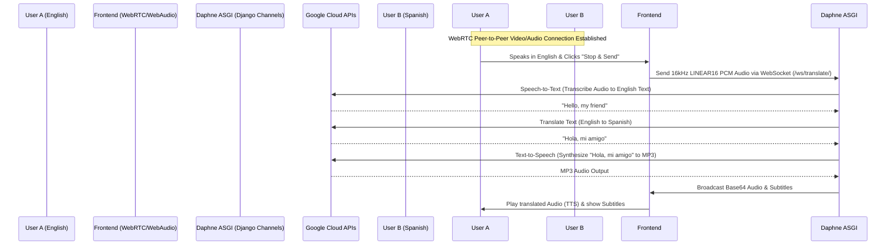

# 🌐 TalkBridge

### *Bridging the language gap in real-time video communication.*

**TalkBridge is a high-accuracy, real-time voice translation and WebRTC video chat platform. It enables users from different linguistic backgrounds to connect over video calls, automatically transcribing, translating, and speaking their conversations aloud in their chosen language in real time.**

[](https://djangoproject.com)
[](https://webrtc.org)
[](https://cloud.google.com)
[](https://docker.com)
[](https://nginx.org)

---

## 🚀 How it Works



1. **WebRTC Video Session**: Users join a shared room code. The signaling server (Django Channels WebSocket) facilitates the SDP offer/answer exchange and ICE candidate gathering, establishing a direct peer-to-peer video connection.
2. **Audio Capture**: Using the browser's native **Web Audio API**, voice is captured, resampled to 16kHz mono, converted to 16-bit signed PCM data, and streamed to the server.
3. **Speech Recognition (STT)**: The backend processes the PCM stream via **Google Cloud Speech-to-Text** (using high-accuracy models) to produce an English transcript.
4. **Translation**: The transcript text is translated into the recipient's chosen target language using **Google Cloud Translation**.
5. **Speech Synthesis (TTS)**: The translated text is synthesized into natural-sounding speech in the target language using **Google Cloud Text-to-Speech** (MP3 format).
6. **Delivery**: The synthesized audio is base64-encoded and sent back over the WebSocket connection to be played automatically, alongside on-screen subtitles.

---

## ⚡ Features

### 🎥 WebRTC Multi-user Video Chat
- **Instant Video Rooms**: Create or join unique 8-character room codes.
- **Media Controls**: Quick mute microphone and disable camera buttons.
- **Cross-Browser Compatibility**: Out-of-the-box support for modern browsers using `adapter.js`.

### 🗣️ Dynamic Voice Translation
- **Multiple Languages**: Supports translations between English (`en-US`), Spanish (`es-ES`), French (`fr-FR`), and Hindi (`hi-IN`).
- **High-Accuracy Recognition**: Powered by Google Cloud's Speech-to-Text engine.
- **Natural TTS Voice Feedback**: Delivers real-time synthesized voice responses instantly on the browser client.
- **Bilingual Subtitles**: Visual subtitle overlays showcasing both original spoken text and translated text.

### 🛡️ Production Architecture & Security
- **Authentication**: JWT-based secure registration and login using Django REST Framework & SimpleJWT.
- **Dockerized Architecture**: Standard multi-container orchestration comprising Postgres DB, Redis channel layer, Daphne server, and Nginx.
- **Nginx Reverse Proxy**: Secure, highly efficient traffic distribution routing for frontend static pages, REST APIs (`/api/`), and WebSockets (`/ws/`).

---

## 📂 Directory Structure

```text
TalkBridge/
├── backend/
│   ├── core/                  # Django App containing models, views, routing, consumers
│   │   ├── consumers.py       # WebRTC signaling and Google Translation WebSocket logic
│   │   ├── models.py          # User schema, Room and Transcript configurations
│   │   └── views.py           # REST APIs for Auth & Room creation/joining
│   ├── talkbridge/            # Django main settings and ASGI/WSGI entrypoints
│   ├── Dockerfile
│   ├── manage.py
│   └── requirements.txt
├── frontend/
│   ├── static/
│   │   ├── css/
│   │   └── js/
│   │       └── main.js        # WebAudio API, WebRTC connection, and Socket streams
│   ├── index.html             # Login and Room Select Dashboard
│   └── room.html              # Main Video call page & Subtitles box
├── nginx/
│   └── nginx.conf             # Nginx reverse proxy configuration
├── docker-compose.yml         # Dev/Prod multi-container runner script
└── .env                       # Environment credentials (Git-ignored)
```

---

## 🛠️ Installation & Setup

### Prerequisites
- Docker & Docker Compose
- Google Cloud Platform account with **Speech-to-Text**, **Translation**, and **Text-to-Speech** APIs enabled.
- A service account key JSON file downloaded from GCP Console.

### 1. Configure Credentials
Place your Google Cloud Service Account Credentials file inside the `backend` folder as `google_credentials.json`:
`c:\Users\kotia\Desktop\Projects\TalkBridge\backend\google_credentials.json`

### 2. Environment Setup
Create a `.env` file in the root directory:
```env
# Database Settings
POSTGRES_DB=talkbridge
POSTGRES_USER=postgres
POSTGRES_PASSWORD=your_secure_password
POSTGRES_HOST=db

# Redis settings (Used by Channels)
REDIS_HOST=redis

# Google Credentials location inside the docker container
GOOGLE_APPLICATION_CREDENTIALS=/app/google_credentials.json
```

### 3. Spin up with Docker Compose
Run the following command to build and launch all services:
```bash
docker-compose up --build
```
This command starts:
- **db**: PostgreSQL database container.
- **redis**: Redis channel layer for handling WebSocket signaling.
- **backend**: Daphne ASGI server serving Django applications at port `8000`.
- **nginx**: Nginx reverse proxy serving the static frontend and forwarding WebSocket/API requests at port `80`.

Open [http://localhost](http://localhost) in your browser to access the application.

---

## 💻 Manual Local Development Setup

If you prefer to run services manually without Docker, follow these steps:

### Backend Setup
1. **Initialize Virtual Environment**:
   ```bash
   cd backend
   python -m venv venv
   source venv/bin/activate  # On Windows: venv\Scripts\activate
   ```
2. **Install Dependencies**:
   ```bash
   pip install -r requirements.txt
   ```
3. **Database Migrations**:
   Make sure you have PostgreSQL running locally, or configure Django to use SQLite for development inside `talkbridge/settings.py`.
   ```bash
   python manage.py migrate
   ```
4. **Run Server**:
   Ensure you set `GOOGLE_APPLICATION_CREDENTIALS` in your terminal pointing to your Google Cloud JSON key.
   ```bash
   python manage.py runserver 8000
   ```

### Frontend Setup
You can serve the `frontend` folder using any local static server (e.g., Live Server in VS Code, or python http.server).
```bash
cd frontend
python -m http.server 8080
```
Make sure `main.js` points to your backend URL (`ws://localhost:8000`).

---

## 📡 API & WebSocket Protocols

### Auth REST Endpoints
- `POST /api/auth/register/` - Registration & Initial Preferred Language Selection.
- `POST /api/rooms/create/` - Create a secure call room.
- `POST /api/rooms/join/` - Join an existing call room.

### WebSocket Channels
- **Signaling**: `ws/signal/<room_code>/` - Relays WebRTC SDP offers, answers, and ICE candidate details between peers.
- **Translation**: `ws/translate/` - Handles incoming PCM voice chunks from the client, coordinates Google Cloud Translation workflows, and returns translation transcription and base64 MP3 voice response.
